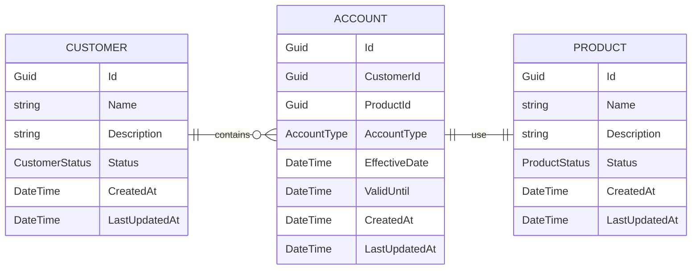
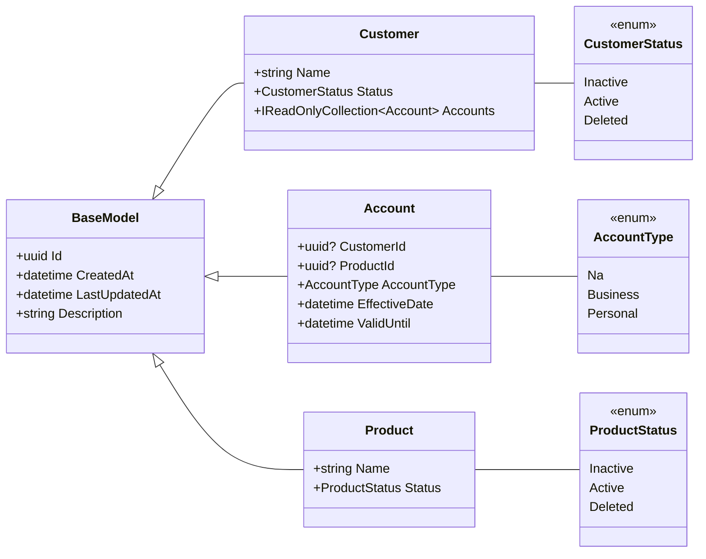
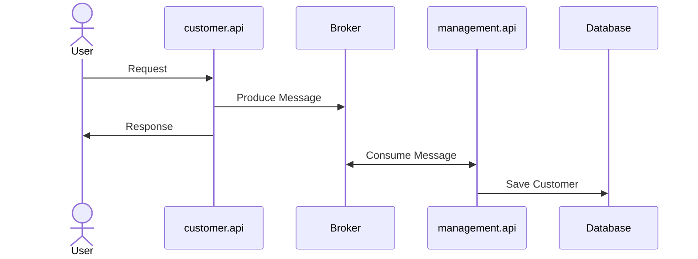

# Energo Service DEMO

### Overview
This demo shows simple communication between microservices and a management application.

### Context diagram

### Class Diagram

### Add Customer
The diagram below shows the "Add customer Process".

