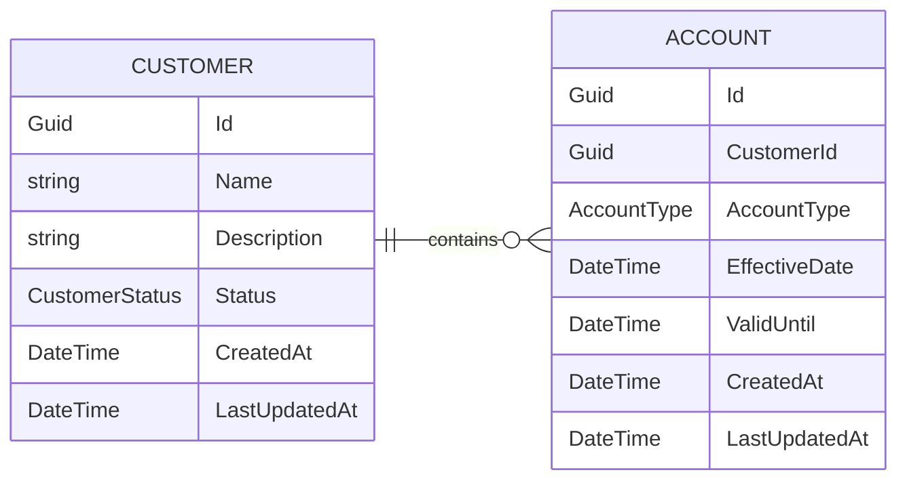

# Energo Service DEMO

### Overview
This demo shows simple communication between microservices and a management application.

### Context diagram

```mermaid
erDiagram
    direction LR
    
    CUSTOMER ||--o{ ACCOUNT : contains
    CUSTOMER {
        Guid Id
        string Name
        string Description
        CustomerStatus Status
        DateTime CreatedAt
        DateTime LastUpdatedAt
    }
    ACCOUNT {
        Guid Id
        Guid CustomerId
        AccountType AccountType
        DateTime EffectiveDate
        DateTime ValidUntil
        DateTime CreatedAt
        DateTime LastUpdatedAt
    }
```
